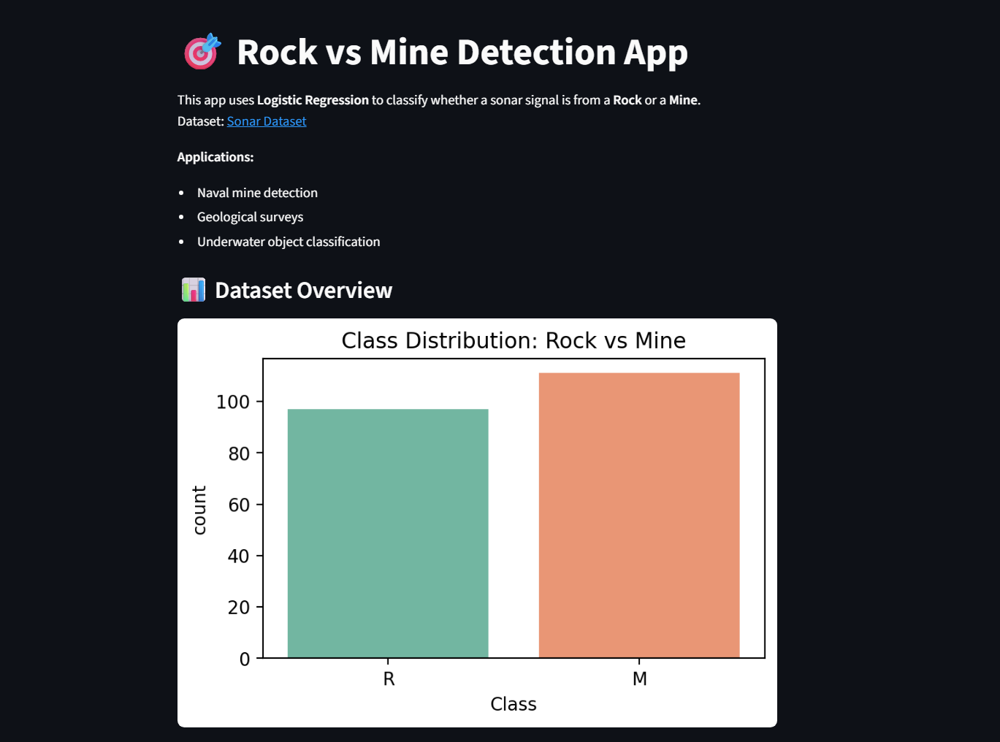
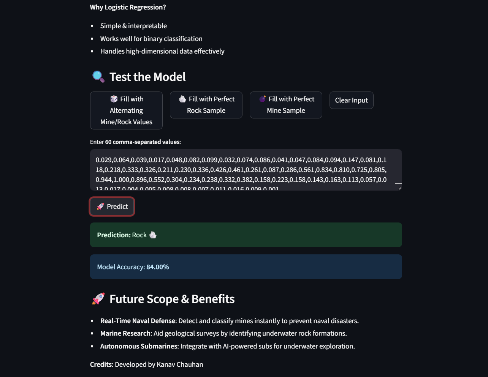

# Rock vs Mine Prediction

This project is a **machine learning classification model** that predicts whether a given object is a **rock** or a **mine** based on sonar data.

## 📌 Project Overview
Using the **Sonar Dataset**, this model learns from various frequency reflection patterns to classify objects detected by sonar into:
- **Rock (R)**
- **Mine (M)**

We use **Logistic Regression** as the classification algorithm due to its simplicity, interpretability, and effectiveness in binary classification problems.

## 🚀 Features
- **Interactive Web App** built using Streamlit.
- **Random Test Sample Generator** for instant predictions.
- **Data Visualization** using Plotly & Altair.
- Real-time prediction for user-provided values.

## 🛠 Technologies Used
- **Python 3**
- **Pandas, NumPy** for data handling.
- **Scikit-learn** for Logistic Regression model.
- **Streamlit** for web-based user interface.
- **Plotly & Altair** for visualizations.

## 📊 Model Details
- **Algorithm:** Logistic Regression
- **Accuracy:** ~83% (may vary depending on random state and data split)
- **Target:** Rock (R) or Mine (M)

## 📈 How It Works
1. The sonar dataset is loaded and preprocessed.
2. The Logistic Regression model is trained to distinguish between rocks and mines.
3. The Streamlit app allows users to:
   - Enter custom feature values.
   - Generate random test samples from the dataset.
   - View predictions instantly.

## 💡 Real-World Applications
- **Naval Mine Detection**: Assists in identifying mines in sea exploration.
- **Submarine Navigation**: Helps avoid hazardous underwater objects.
- **Geological Surveys**: Differentiates rock types in underwater studies.

## ▶️ How to Run
1. Clone the repository:
   `
   git clone https://github.com/Kanav-Chauhan/Rock-vs-Mine-Prediction.git`
2. Open The folder:
   `cd rock-vs-mine-prediction`
3. Install Dependencies:
   `
   pip install -r requirements.txt`

4. Run the app:
   ` 
   streamlit run main.py`

 # Made with ❤️ by Kanav Chauhan 

   

   

